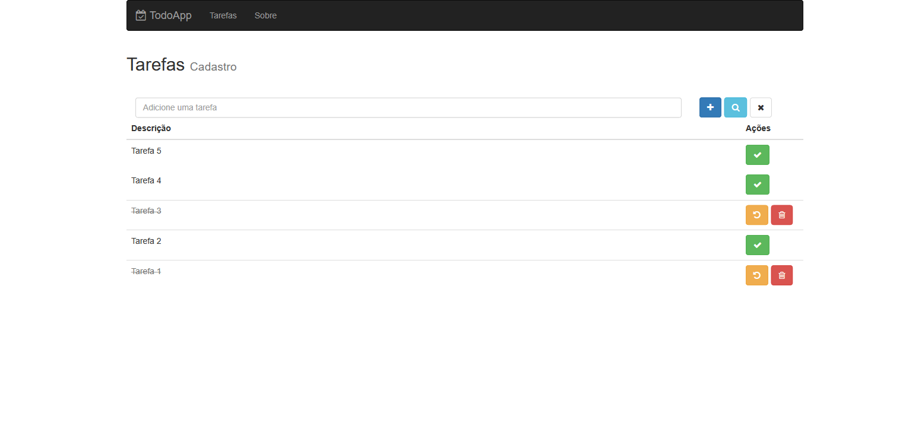

# Todo App

## Descrição

Uma aplicação simples de cadastro de tarefas. Projeto desenvolvido para estudo do React com Redux.

## Back-end

No desenvolvimento da API Rest foi utilizado o [Node.js](https://nodejs.org/en/).

## Front-end

A aplicação Web foi feita usando [React](https://pt-br.reactjs.org/) com [Redux](https://redux.js.org/).

